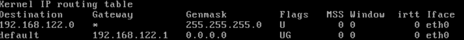

# Execution (this is for my own notes and understanding)

a. The Kali interface's MAC address is - 52:54:00:1c:d7:2d

b. The Kali interface's IP address is - 192.168.122.57

c. The Metasploit interface's MAC address is - 52:54:00:20:07:84

d. The Metasploit interface's IP address is - 192.168.122.14

e. Kali's routing table: 

f. Kali's ARP cache: 

g. Metasploitable's routing table: 

h. Metasploitable's ARP cache: 

i. To the MAC address: 52:54:0d:42:59 (the host machines)

j. I captured no packages

k. I did these steps 

l. yes. It changed its gateway MAC to the Kali VM
